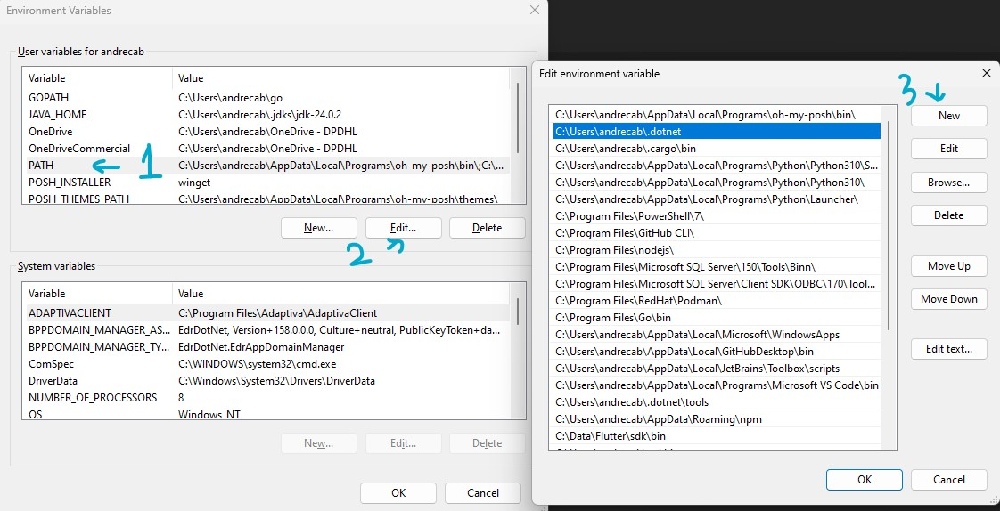

# Ravelaso UiPath Template

A multi-project template for UiPath activities ported from the original VisualStudio template.


## New in v2.1.3

New documentation added on how to create your activity and explaining the templates in this repo.
Templates now contain an optional **Examples parameter** if you want to see a **Calculator example**.
By **default it is false**, so you will get the new skeleton template, to quick start a project.

Please read below the **How To Use!**

## New in v2.0.0

A set of new templates with examples have been added.
Contains an activity only project(no viewmodel, no test), an activity project with viewmodel, and the default solution template with all the projects, as it used to be in version v1.x.x

This means new project templates may be added.

## Install

To use this template, install it from nuget.org using the following command:

```sh
dotnet new install Ravelaso.UiPath.Template
```

## Nuget Source

In order to restore the packages, you will need to add the UiPath Azure nuget registry:

```sh
dotnet nuget add source https://pkgs.dev.azure.com/uipath/Public.Feeds/_packaging/UiPath-Official/nuget/v3/index.json -n UiPath
```


# How to Use?!

This would be a quick guide to create an activity for UiPath.

## 0. Requirements

- .NET 6
- A text editor or IDE (VisualStudio / Jetbrains Rider / VSCode )
- Activity Templates


## 1. Before you start

Install the latest .NET 6 (SDK) which is the version used by UiPath to develop.

I recommend downloading the binaries and manually add it to your path *(trust me, no IT needed, better version managing)*.

To install .NET the **`PRO`** way:

1. [Get .NET 6 Binaries (Windows x64)](https://dotnet.microsoft.com/en-us/download/dotnet/6.0)

2. Create a folder called `.dotnet` within your user folder: `C:\Users\%USERNAME%\.dotnet`

3. Unzip the content of .NET 6 SDK inside the `.dotnet` folder you created in your user profile

4. Hit the keys WINDOWS + R, and in the run input, paste `rundll32 sysdm.cpl,EditEnvironmentVariables` then hit enter.

5. Select PATH, then click Edit, in the new window, click New and add the path to `C:\Users\%USERNAME%\.dotnet` (changing %USERNAME% to your username), then OK, or Save or Accept...

    

6. Open a terminal and run the command, ```dotnet --info```, a lot of information will show about dotnet being installed.


## 1.1 Templates

To simplify creating UiPath custom activities with .NET, this repository provides a set of templates derived from the official UiPath activity template. These templates are cleaned up, modernized, and extended for different development workflows.

Before using any of them, make sure to add the UiPath package registry (required for referencing UiPath assemblies):

```sh
dotnet nuget add source https://pkgs.dev.azure.com/uipath/Public.Feeds/_packaging/UiPath-Official/nuget/v3/index.json -n UiPath
```

You can then verify the registered sources:

```sh
dotnet nuget list source
```

You should see a new source named **UiPath** pointing to the Azure feed.

---

### Available Templates

#### 1. `ravelaso-uipath-activity`
**Type:** Project
**Use case:** Create a simple custom activity project.

- Includes a base `Activity.cs` file and `Helpers` directory.
- Supports an optional `--Examples true` flag to scaffold example code into the project. (Calculator example)
- Best for starting lightweight activities quickly.
- You need to pack the project yourself.

Create a new project:
```sh
dotnet new ravelaso-uipath-activity -n MyActivity
```

With examples:
```sh
dotnet new ravelaso-uipath-activity -n MyActivity --Examples true
```

---

#### 2. `ravelaso-uipath-activity-vm`
**Type:** Project
**Use case:** Create a custom activity project following the **MVVM (ViewModel)** pattern.

- Includes additional folders for `Resources` and `ViewModels`.
- Generates a `ActivityViewModel.cs` alongside the activity class.
- Also supports the `--Examples true` flag to scaffold example code (Calculator example).
- Best for UI-based activities or when following a clean MVVM structure.
- You need to pack the project yourself.

Create a new project:
```sh
dotnet new ravelaso-uipath-activity-vm -n MyActivityVM
```

With examples:
```sh
dotnet new ravelaso-uipath-activity-vm -n MyActivityVM --Examples true
```

---

#### 3. `ravelaso-uipath` (Default)
**Type:** Solution
**Use case:** Full solution template for professional development.

- Generates a Visual Studio solution with two projects:
  - **Package Project** → builds the NuGet package containing your custom activity.
  - **Tests Project** → unit test project preconfigured for testing your activities.

Create a new solution:
```sh
dotnet new ravelaso-uipath -n MySolution
```


# 2. Understanding Activities

The activities for UiPath are classes that ihnerit the default ```CodeActivity``` class from UiPath.

Whenever you want an activity, you may create a class that derives from the uipath one, in a new file perhaps, like this:

```csharp
public class MyCoolActivity : CodeActivity {

}
```

Inside your class, you can start by defining the inputs and outputs you will need.
In order to create those Arguments you need to use the provided classes; ```InArgument``` and ```OutArgument```.

Example:

```csharp
public class MyCoolActivity : CodeActivity {

    public InArgument<string> YourName {get; set;}

    public OutArgument<string> Result {get; set;}

}
```

Every ```CodeActivity``` has a protected method called ```Execute```.

This method is where we do our logic. We could do it inside the method, or create our custom classes for the logic and call them inside the ```Execute``` method.

Every ```Execute``` method requires a **context**, this is basically telling the activity that is the current run of the process, from which we can extract the **Arguments** values do something.

Following our example, here is how we can implement a logic for our Activity:


```csharp
public class MyCoolActivity : CodeActivity {

    // Define the Arguments
    public InArgument<string> YourName {get; set;}

    public OutArgument<string> Result {get; set;}

    // Define the Execute methods creating a CodeActivityContext
    protected override void Execute(CodeActivityContext context){

        // Get the InArgument value
        var yourName = YourName.Get(context);

        // Do something with it...
        var result = $"Hello {yourName}, Welcome Back!"

        // Set the Result argument with the new data
        Result.Set(context, result)
    }

}
```

When this activity executes, the value for **YourName** will be use to construct a welcome message and it will be returned in the **Result** variable.

From the Activity onwards, the Result will contain the new welcome message and you can use it in another UiPath activity or do whatever you want with it.


# 3. Designing Activities.

The default way of creating activities might be useful for simple tasks, but when we need to design a better *User Interface* for the activity, or we just want to add more descriptives names, we can use [Decorators](https://en.wikipedia.org/wiki/Decorator_pattern).

Basically, we have a set of attributes we can use on top of our **Arguments** to modifiy their behaviour, without having to create again the code specific for them, think of it like dynamic styles or properties we can add if needed to our **Arguments**


Having a look at our previous example...

```csharp
public class MyCoolActivity : CodeActivity {

    // Define the Arguments
    public InArgument<string> YourName {get; set;}

    public OutArgument<string> Result {get; set;}

    // Define the Execute methods creating a CodeActivityContext
    protected override void Execute(CodeActivityContext context){

        // Get the InArgument value
        var yourName = YourName.Get(context);

        // Do something with it...
        var result = $"Hello {yourName}, Welcome Back!"

        // Set the Result argument with the new data
        Result.Set(context, result)
    }

}
```

We can start adding **Decorators** to the Main activity class,
lets add the DisplayName and the Description. These decorators will modify what the Name of our activity will be and its description when looking for the Activity inside UiPath:


```csharp

[DisplayName("My Cool Activity")]
[Description("This activity returns a welcome message using the name you give as an input")]
public class MyCoolActivity : CodeActivity {

    // Define the Arguments
    public InArgument<string> YourName {get; set;}

    public OutArgument<string> Result {get; set;}

    // Define the Execute methods creating a CodeActivityContext
    protected override void Execute(CodeActivityContext context){

        // Get the InArgument value
        var yourName = YourName.Get(context);

        // Do something with it...
        var result = $"Hello {yourName}, Welcome Back!"

        // Set the Result argument with the new data
        Result.Set(context, result)
    }

}
```


These Decorators also work on the **In/Out Arguments**


```csharp

[DisplayName("My Cool Activity")]
[Description("This activity returns a welcome message using the name you give as an input")]
public class MyCoolActivity : CodeActivity {

    // Define the Arguments

    [DisplayName("Your Name")]
    [Description("Insert your name here")]
    [Category("Input")]
    public InArgument<string> YourName {get; set;}

    [DisplayName("Welcome Message")]
    [Description("The returning welcome message as string")]
    [Category("Output")]
    public OutArgument<string> Result {get; set;}

    // Define the Execute methods creating a CodeActivityContext
    protected override void Execute(CodeActivityContext context){

        // Get the InArgument value
        var yourName = YourName.Get(context);

        // Do something with it...
        var result = $"Hello {yourName}, Welcome Back!"

        // Set the Result argument with the new data
        Result.Set(context, result)
    }

}
```


Now, our activity will have a proper name to be found inside UiPath,
and we can show some tooltips explaining what each argument is for, etc.

## 3.1 Advance Design

If our activity requires complex UI, like dropdowns and other types of UI Elements we need to use [ViewModel](https://en.wikipedia.org/wiki/Model%E2%80%93view%E2%80%93viewmodel).

This is a way in which we will have a **ViewModel** file (class) which will handle all the complex UI, and it will be connected to our
**Activity** base class, which will contain the definition of Arguments we need and how to execute the logic, the whole design of the UI will be handled now by the new **ViewModel** class.

There is a template you can use in the template packs I have for this, the **Activity Project(ViewModel)**.

This will create a new project with the ViewModel and the Activity classes ready to go, it comes with a sample calculator activity so we can learn from it.

In this example activity, we want to build a complex UI element, a dropdown selector to choose which operation to do in our calculator, based on this selection our single activity can do more than just one thing! For this we are going to use an [Enumerator](https://en.wikipedia.org/wiki/Enumerated_type) as you se here:

```csharp
public enum Operation
{
    Add,
    Subtract,
    Multiply,
    Divide
}
```

Now that we have our selection of options, we can construct the **CodeActivity** as usual.

```csharp
public class CalculatorActivity : CodeActivity<int>
{

    [RequiredArgument]
    public InArgument<int> FirstNumber { get; set; }

    [RequiredArgument]
    public InArgument<int> SecondNumber { get; set; }

    [RequiredArgument]
    public Operation SelectedOperation { get; set; } = Operation.Multiply;
}
```

This new activity uses an actual return value, where we do not have an OutArgument defined, but we explicitly tell the ``CodeActivity<int>`` meaning, we are returning an ``int`` type. You can see that we also have besides the two integer InArguments, a SelectedOperation property which is of type **Operation**, our Enumerator with the options.

Now we can finish our Activity class by creating the **Execute** method. In this case, since we are declaring our **CodeActivity** is returning an **int type** ( ``CodeActivity<int>`` ), we do not need to create and set the result variable in the activity, we will handle all this in the UI Class (ViewModel), so our **Execute** method will get the values of the InArguments and do the operations and return directly the result.

```csharp
protected override int Execute(CodeActivityContext context)
{
    // Get the values.
    var firstNumber = FirstNumber.Get(context);
    var secondNumber = SecondNumber.Get(context);

    // Verify if selection is divide, is it dividing by 0?
    if (secondNumber == 0 && SelectedOperation == Operation.Divide)
    {
        throw new DivideByZeroException("Second number should not be zero when the selected operation is divide");
    }

    // Return an operation based on the dropdown selection
    return SelectedOperation switch {
        Operation.Add => firstNumber + secondNumber,
        Operation.Subtract => firstNumber - secondNumber,
        Operation.Multiply => firstNumber * secondNumber,
        Operation.Divide => firstNumber / secondNumber,
        _ => throw new NotSupportedException("Operation not supported"),
    };
}
```


Now our Activity is ready to work, but it doesn't have a nice UI.
For this, we will create a ViewModel class in a ViewModels folder.

We will start our **ViewModel** class like the **Activity** class, by making it inherit from the **DesignPropertiesViewModel** class.

```csharp
public class CalculatorActivityViewModel : DesignPropertiesViewModel
{
}
```

We will use the same **Names** for the **Properties** we defined in our **Activity** class, but instead of using the **InArgument** or **OutArgument** class we will use the Design ones

```csharp
public class CalculatorActivityViewModel : DesignPropertiesViewModel
{
    // Define the inputs
    public DesignInArgument<int> FirstNumber { get; set; }
    public DesignInArgument<int> SecondNumber { get; set; }
    // Define the Operation Enum
    public DesignProperty<Operation> SelectedOperation { get; set; }
    // Define the output
    public DesignOutArgument<int> Result { get; set; }
}
```

Next step is, [Dependency Injection](https://en.wikipedia.org/wiki/Dependency_injection),
for our new ViewModel class to also work, we need to inject the **IDesignServices** interface.
We do this by adding it to what's called the [Constructor of our Class](https://en.wikipedia.org/wiki/Constructor_(object-oriented_programming)) (just adding the following line):

```csharp
public class CalculatorActivityViewModel : DesignPropertiesViewModel
{
    // Define the inputs
    public DesignInArgument<int> FirstNumber { get; set; }
    public DesignInArgument<int> SecondNumber { get; set; }
    // Define the Operation Enum
    public DesignProperty<Operation> SelectedOperation { get; set; }
    // Define the output
    public DesignOutArgument<int> Result { get; set; }

    public CalculatorActivityViewModel(IDesignServices services) : base(services)
    {
    }
}
```


The **DesignPropertiesViewModel** class also has a method we need to override like with the **Activity** class.
This method is called *InitializeModel()*

To implement this method we will start by writing this new line:

```csharp
public class CalculatorActivityViewModel : DesignPropertiesViewModel
{
    // Define the inputs
    public DesignInArgument<int> FirstNumber { get; set; }
    public DesignInArgument<int> SecondNumber { get; set; }
    // Define the Operation Enum
    public DesignProperty<Operation> SelectedOperation { get; set; }
    // Define the output
    public DesignOutArgument<int> Result { get; set; }

    public CalculatorActivityViewModel(IDesignServices services) : base(services)
    {
    }

    protected override void InitializeModel()
    {
        // Base initialization of our UI
        base.InitializeModel();
        PersistValuesChangedDuringInit();
    }
}
```

After our base initialization of our UI, in that method, we can now continue to write styles for the properties we have.
We can set things like **.IsPrincipal**, this will make this property shown in the Main Activity Block (not in the properties type)
An example would be:

```csharp
public class CalculatorActivityViewModel : DesignPropertiesViewModel
{
    // Define the inputs
    public DesignInArgument<int> FirstNumber { get; set; }
    public DesignInArgument<int> SecondNumber { get; set; }
    // Define the Operation Enum
    public DesignProperty<Operation> SelectedOperation { get; set; }
    // Define the output
    public DesignOutArgument<int> Result { get; set; }

    public CalculatorActivityViewModel(IDesignServices services) : base(services)
    {
    }

    protected override void InitializeModel()
    {
        // Base initialization of our UI
        base.InitializeModel();
        PersistValuesChangedDuringInit();

        // First number styles
        FirstNumber.DisplayName = "First Number";
        FirstNumber.Tooltip = "First number for the operation";
        FirstNumber.IsRequired = true;
        FirstNumber.IsPrincipal = true;

        // Second number styles
        SecondNumber.DisplayName = "Second Number";
        SecondNumber.Tooltip = "Second number for the operation";
        SecondNumber.IsRequired = true;
        SecondNumber.IsPrincipal = true;

        // Dropdown styles
        SelectedOperation.DisplayName = "Select Operation";
        SelectedOperation.Tooltip = "Select the operation to calculate";
        SelectedOperation.IsRequired = true;
        SelectedOperation.IsPrincipal = true;

        // Output styles
        Result.DisplayName = "Result Operation";
        Result.Tooltip = "The result Integer";
    }

}
```

Now we should have the code necessary to show a nice Activity with an UI that shows all the properties in the main block of the Activity UI (for easy access to them) and a Dropdown to select from our enumerator.

However, when creating ViewModels, there is an extra steps we need to do. Inside the Resources folder in our project, there is a **JSON** file called **ActivitiesMetadata.json**. This file tells UiPath how to find ViewModels and Activities and link them together, also providing the Name and Description for each activity.

Basically we link the **fullName** property to the Activity file, and the **viewModelType** to the ViewModel file which is inside the ViewModels folder, using [Namespaces](https://en.wikipedia.org/wiki/Namespace).

This is how it would look like:

```json
{
  "resourceManagerName": "MyProjectName.Resources.Resources",
  "activities": [
    {
      "fullName": "MyProjectName.CalculatorActivity",
      "shortName": "CalculatorActivity",
      "displayName": "Calculator Activity",
      "description": "This is an example activity",
      "categoryKey": "Examples",
      "viewModelType": "MyCompany.ViewModels.CalculatorActivityViewModel"
    }
  ]
}
```

